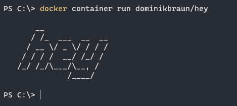

---

### Run in Docker

```shell script
$ docker container run dominikbraun/hey
```

### Run in Kubernetes

```shell script
$ kubectl apply -f https://dominikbraun.io/hey.yml
$ kubectl logs pod/hey
```
